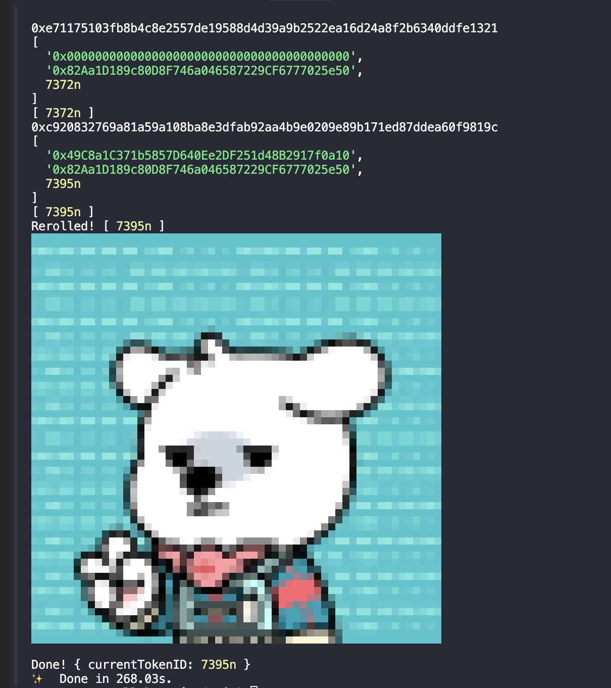

# dn404 reroll bot 🧬



## Usage

```env
PRIVATE_KEY=0x
RPC_URL=https://

DN404_ADDRESS=0x
DN404_MIRROR_ADDRESS=0x

CURRENT_TOKEN_ID=7269
TARGET_TOKEN_ID=7395
```

| env                    | description                                                                                |
| :--------------------- | :----------------------------------------------------------------------------------------- |
| `PRIVATE_KEY`          | Private key of the wallet that will be used for rerolling                                  |
| `RPC_URL`              | RPC URL of Ethereum Mainnet (defaults to [`https://eth.merkle.io`](https://eth.merkle.io)) |
| `DN404_ADDRESS`        | Address of `DN404` contract                                                                |
| `DN404_MIRROR_ADDRESS` | Address of `DN404Mirror` contract (`dn404.mirrorERC721()`)                                 |
| `CURRENT_TOKEN_ID`     | Current token ID that you want to reroll from (wallet should own this token)               |
| `TARGET_TOKEN_ID`      | Target token ID that you want to reroll to                                                 |

```bash
yarn start
```

## References

- https://github.com/Vectorized/dn404
- https://github.com/byeongsu-hong/dn404-reroller
